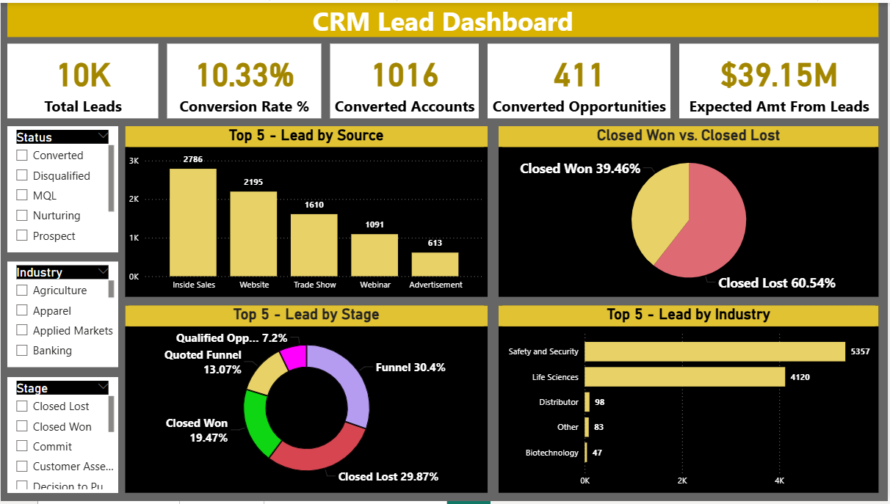
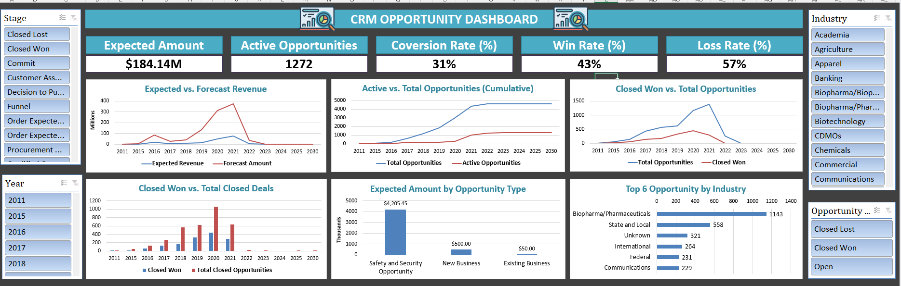
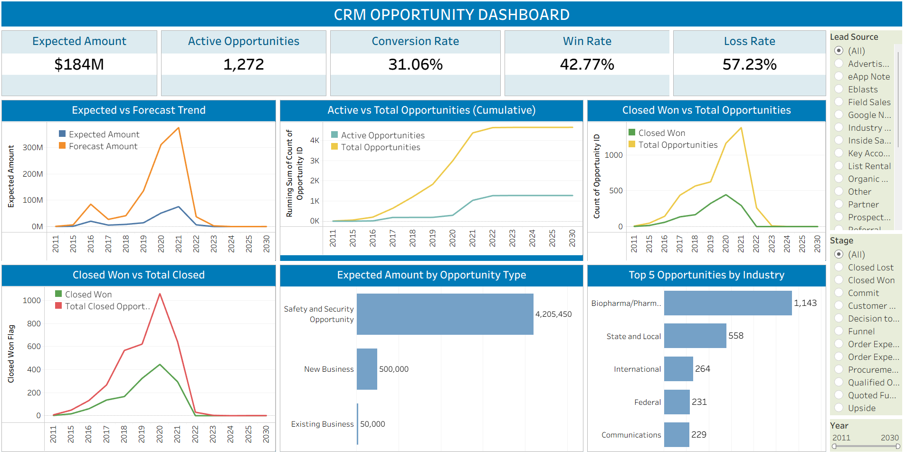

# 📊 CRM Analytics Dashboard

## 🧠 Problem Statement

Organizations need a unified view of their sales pipeline to track lead generation, conversion performance, and revenue outcomes. This project provides an end-to-end CRM analytics solution covering both Lead and Opportunity stages to support data-driven decision-making.

---

## 🎯 Project Objective

To analyze CRM data and build interactive dashboards that:

* Track lead generation and quality
* Monitor conversion across sales stages
* Evaluate opportunity performance
* Identify key drivers of revenue

---

## 📌 Key KPIs

### 🔹 Lead Metrics

* Total Leads
* Expected Revenue from Leads
* Converted Accounts
* Converted Opportunities
* Conversion Rate (%)

### 🔹 Opportunity Metrics

* Total Expected Amount
* Active Opportunities
* Win Rate (%)
* Loss Rate (%)

---

## 📊 Dashboard Features

### 🔹 Lead Analysis Dashboard

* KPI overview of lead generation and conversion performance
* Top leads by Industry analysis
* Lead source performance tracking
* Lead stage distribution (funnel analysis)
* Country-wise converted opportunities
* Interactive filters for Status, Year, and Conversion

### 🔹 Opportunity Analysis Dashboard

* KPI summary of opportunity performance and revenue
* Expected vs Forecast revenue trend analysis
* Active vs Total opportunities (cumulative view)
* Closed Won vs Total opportunities tracking
* Opportunity type revenue breakdown
* Industry-wise opportunity performance
* Interactive filters for Stage, Year, and Lead Source

---

## 📸 Dashboard Preview

### 🔹 Lead Dashboard

### 🔹 Opportunity Dashboard

---

## 📈 Key Insights

* Strong lead generation is observed, but conversion rates indicate a need for optimization in later pipeline stages
* Revenue potential is significant, however it is highly dependent on opportunity closing efficiency
* Sales performance and conversion efficiency directly impact overall profitability
* Higher-quality leads contribute more to successful conversions than sheer lead volume
* Significant drop-off observed between lead and opportunity stages, highlighting a key area for process improvement
* Tracking closed-won opportunities is essential for accurate revenue forecasting

---

## 🗂️ Data Model

The project uses a relational CRM data model consisting of:

* tbl_Lead
* tbl_Account
* tbl_Opportunity table
* tbl_Opportunity product

---

## ⚙️ Tools & Technologies

* Microsoft Excel (Power Pivot / Data Model)
* Power BI
* Tableau

---

## 📁 Project Structure

* /data → Dataset files
* /dashboards → Excel, Power BI & Tableau dashboards
* /screenshots → Dashboard images

---

## 🚀 Business Impact

* Helps identify bottlenecks in the sales funnel
* Improves decision-making through KPI tracking
* Enables better revenue forecasting
* Highlights high-performing industries and lead sources

---

## 👤 Author

Priyanair17
